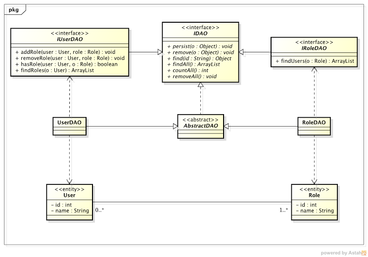

Hibernate
=========

Projeto em Java, com Hibernate, usando Query Nomeada

Programação V

Bacharel em Sistemas de Informação - 5ª Fase

<h3>Modelo UML</h3>

Projeto com Annotation <a href="javascript:void(0)" target="blank">aqui</a>.
